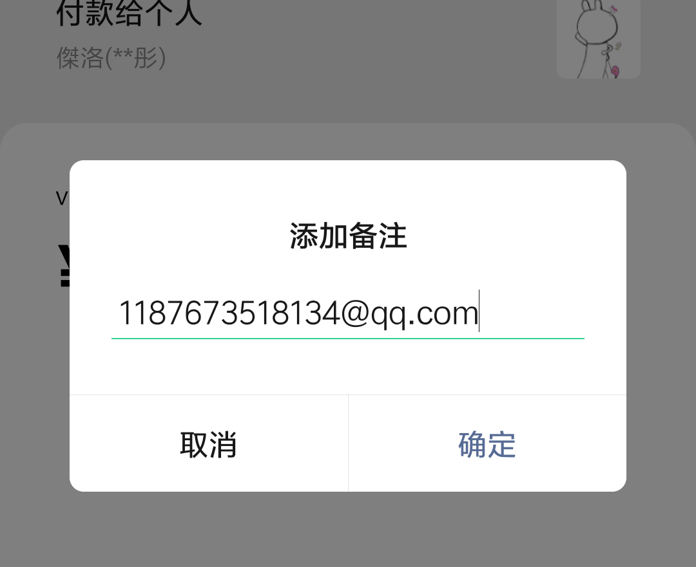

# 付款方式与付款码

请付款之前务必仔细阅读本页内容！

请付款之前务必仔细阅读本页内容！

请付款之前务必仔细阅读本页内容！

扫码付款时，使用微信和支付宝的“备注”功能，填写一个可以联系到你的电子邮箱地址。建议使用QQ邮箱。

我们收到付款后，会将vpn地址和如何连接等相关内容发送到你的邮箱里。为了你后续能正常使用，请一定保证邮箱地址可用。

请先阅读下面的付款方式，这将保证你可以正常付费并可以正常使用。付款码在文末。

## 付款具体操作

### 使用微信付款

#### 1. 在付款页面点击“添加备注”

#### 2. 填写一个能联系到你的邮箱地址。

### 使用支付宝付款

#### 1. 在付款页面点击灰色小字“添加备注”

#### 2. 填写一个能联系到你的邮箱地址

我们收到付款后，会将vpn地址和如何连接等相关内容发送到你的邮箱里。为了你后续能正常使用，请一定保证邮箱地址可用。

## 如果忘了留邮箱或邮箱失效

请发邮件到vpn-service@xtzero.cc，在邮件中请注明**付款成功的订单号**。订单号具体的寻找方法是：

微信在消息列表中，点击“微信支付”，点击对应的订单，在详情页可以找到订单号。

支付宝请前往【我的-账单】，点击对应账单，在详情页可以找到订单号。

请将

+ 复制出来的文本形式的订单号
+ 订单详情页截图

使用邮件发送给 **vpn-service@xtzero.cc**，我们收到邮件后会回复给你后续内容。

## 付款码

请按需求付费！

### 一个月-支付宝

### 一季（3个月）-支付宝

### 半年-支付宝

### 一年-支付宝

### 一个月-微信

### 一季（3个月）-微信

### 半年-微信

### 一年-微信
